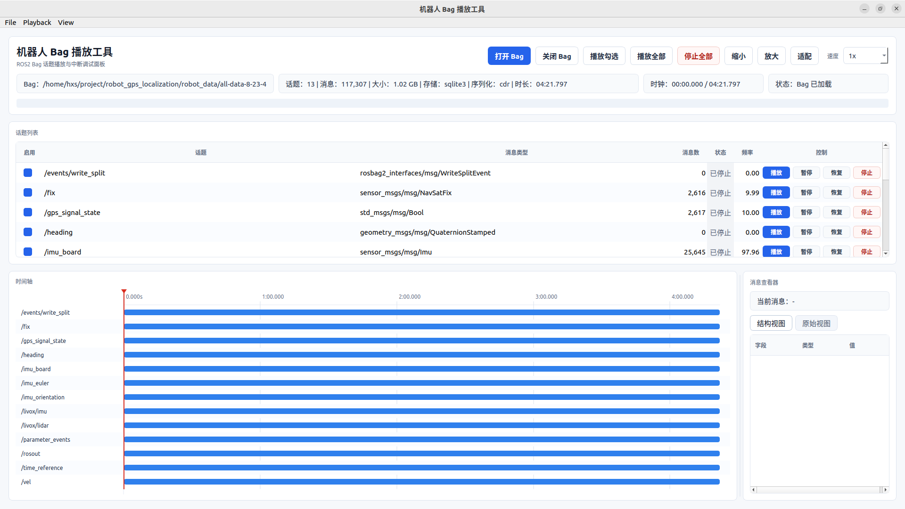

# robot_bag_play_tool

基于 **Qt + ROS 2** 开发的 Bag 播放与调试工具，主要用于机器人数据回放以及融合算法调试过程中，对 Bag 中的指定话题进行选择性播放、暂停和停止。



## 功能特性

- 支持打开指定的 **ROS 2 Bag 目录**。
- 自动解析 Bag 信息，包括：
  - 话题名称
  - 消息类型
  - 消息数量
  - Storage ID
  - 序列化格式
  - Bag 文件大小
  - Bag 数据起止时间
- 提供轻量级 **rqt_bag 风格时间轴**：
  - 按话题显示数据时间范围
  - 红色时间游标
  - 鼠标滚轮平移时间轴
  - `Ctrl + 鼠标滚轮` 缩放时间轴
  - 点击时间轴快速跳转到指定时间
- 支持在 GUI 中对**单个话题进行独立控制**：
  - 启动播放
  - 停止播放
  - 暂停播放
  - 恢复播放
- 支持：
  - 播放全部话题
  - 仅播放勾选的话题
- 所有话题通过**统一的全局播放调度器（Global Scheduler）**进行管理：
  - 保持 Bag 消息原始时间戳顺序
  - 保持各话题之间的时间同步关系
  - 统一发布共享的 `/clock`
- 支持实时显示：
  - 话题发布频率
  - 当前播放时钟
  - 整体播放进度
- 支持点击话题查看 **ROS 2 消息类型结构**：
  - 展开嵌套消息字段
  - 显示字段的完整消息类型
  - 标识固定数组、有界序列、无界序列和字符串长度约束
  - 无需播放或反序列化消息即可查看
- 支持多种播放速度：
  - `0.1x`
  - `0.25x`
  - `0.5x`
  - `1x`
  - `1.5x`
  - `2x`
  - `5x`
  - `10x`
- 提供完整的基础操作菜单：
  - **文件（File）**
  - **播放（Playback）**
  - **视图（View）**
- 自动保存并恢复窗口尺寸、内容面板比例和播放速度。
- 面向机器人数据调试场景设计，可用于融合定位、导航、避障等算法的数据回放与问题复现。

## 编译

将功能包拷贝到ros2工作空间下

```
cd ~/ros2_ws/src
git clone https://github.com/hxs2495/robot_bag_play_tool.git
```

在 ROS 2 工作空间中执行：

```bash
colcon build --packages-select robot_bag_play_tool
```

编译完成后加载工作空间：

```bash
source install/setup.bash
```

## 运行

执行：

```bash
ros2 run robot_bag_play_tool robot_bag_play_tool
```

启动工具后，在界面中选择需要播放的 **ROS 2 Bag 目录**。

> 选择的 Bag 目录中需要包含 `metadata.yaml` 文件。

## 适用场景

该工具主要用于机器人 ROS 2 数据调试，例如：

```text
ROS 2 Bag
   │
   ├── /imu
   ├── /Odometry
   ├── /cloud_registered
   ├── /scan
   ├── /tf
   ├── /tf_static
   └── /cmd_vel
          │
          ▼
   robot_bag_play_tool
          │
          ├── 选择需要播放的话题
          ├── 暂停指定话题
          ├── 恢复指定话题
          ├── 调整播放速度
          ├── 时间轴定位
          └── 查看消息类型结构
```

尤其适合用于**多传感器融合、FAST-LIO、Nav2 导航、定位、规划与避障算法调试**等场景。
